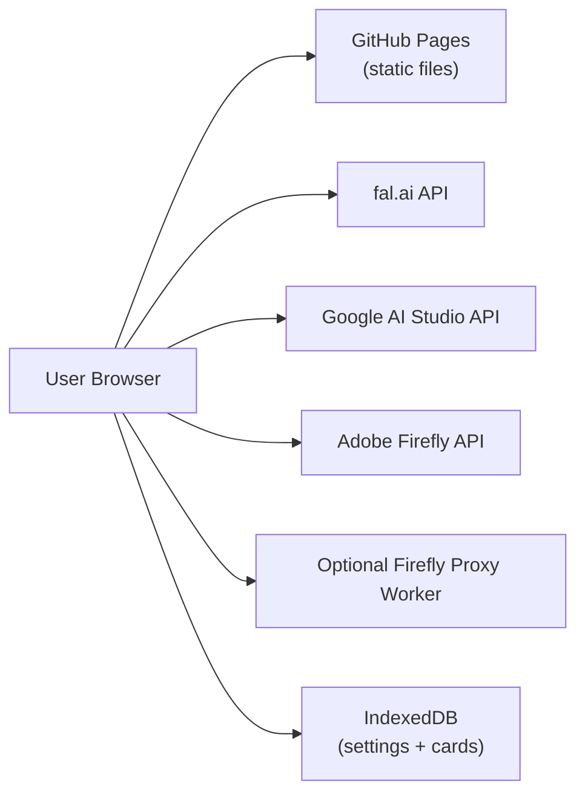
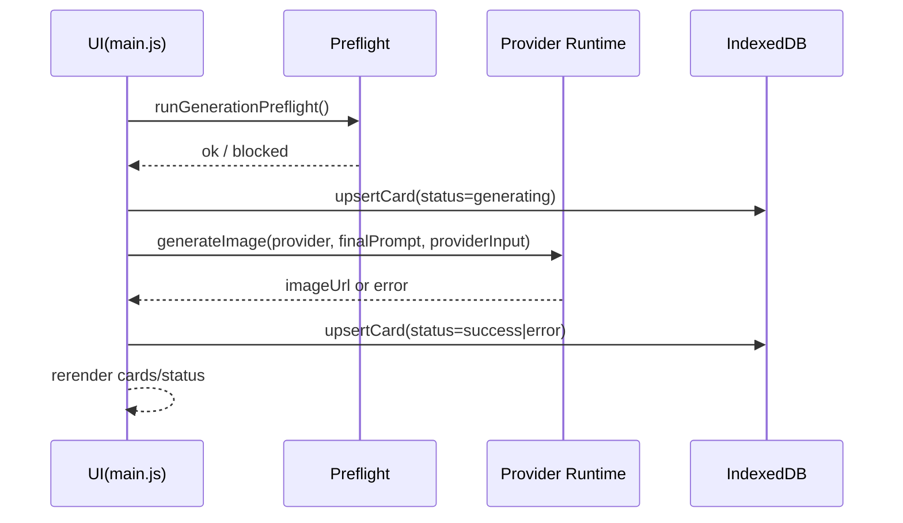

# Architecture: Image Creator

- Document version: 1.1
- Last updated: 2026-02-15

## 1. System Overview
Image Creator is a static, browser-first single-page app.

## 2. Runtime Layers

- **Template Layer** (Eleventy Build-Time)
  - Source: `src-templates/` (Nunjucks `.njk` files).
  - Output: `_site/` (static HTML with templated navigation, head, footer).
  - Tooling: Eleventy 2.0.1 (`npm run build` / `npm run dev`).
  - **Critical**: This layer runs at build time, not runtime.
  - `pathPrefix`: Configured via `ELEVENTY_PATH_PREFIX` env var (default `/`). GitHub Pages sets `/image-creator-app/`. All internal links use Eleventy's `| url` filter to prepend the prefix.

- **UI Layer** (`_site/*.html`, `styles.css`)
  - Tailwind CDN + custom CSS.
  - Form controls, cards grid, preview modals.
  - Generated from Template Layer.

- **Application Layer** (`src/main.js`)
  - Event wiring, rendering orchestration, generation queue control.
  - Loaded via `<script type="module">` in `_site/index.html`.

- **Analytics Layer** (`src/analytics/`)
  - Abstraction over GTM/GA4 for user behavior tracking.
  - Session management, event tracking, provider pattern.
  - Loaded in `src/main.js` via `import { trackEvent } from './analytics/index.js'`.

- **Domain Modules** (`src/*.js`)
  - Template rendering, model catalog, reference image inference, download pipeline.

- **Provider Layer** (`src/providers/*.js`)
  - API-specific request/polling logic (fal, google, firefly).

- **Persistence Layer** (`src/db.js`)
  - IndexedDB load/save/upsert/delete.
  - sessionStorage for model catalog caching.

## 3. Key Module Responsibilities

- `src/main.js`
  - Central state container.
  - UI event binding and end-to-end workflow orchestration.
- `src/settings-form.js`
  - Form <-> settings synchronization.
- `src/generation-preflight.js`
  - Blocking checks before generation (template/provider/reference image).
- `src/model-catalog.js`
  - Provider model list retrieval + normalization.
- `src/model-requirement.js` + `src/model-input.js`
  - fal model schema inspection and image-input requirement inference.
- `src/reference-image.js`
  - Reference image state, URL validation, file-to-dataURL conversion.
- `src/cards-view.js` + `src/card-actions.js`
  - Card DOM rendering and action control.
- `src/download.js`
  - File naming/hash, PNG metadata embed, ZIP packaging.
- `src/providers/fal.js|google.js|firefly.js`
  - Provider request and response handling.
- `src/session-settings.js`
  - Session-only field stripping before persistent save.
- `src/settings-export.js`
  - Settings export to JSON and import validation.

## 4. State Model

In-memory state (owned by `main.js`):
- `settings`: active provider/mode/keys/models/options.
- `cards`: prompt cards and generation results.
- `modelCatalog`: fetched model lists by provider.
- `modelRequirement`: current fal model image-input requirement.
- `referenceImage`: session reference image state.
- `runningCardIds` + `abortControllers`: in-flight job tracking.

Persisted state (IndexedDB):
- `settings` store
- `cards` store

Session-only state:
- Firefly `accessToken` is removed before calling `saveSettings`.

## 5. Data Structures

### 5.1 Settings (logical)
- `activeProvider`: `fal | google | firefly`
- `mode`: `light | advanced`
- `commonPrompt`: string
- `concurrency`: number
- `providers.fal`: `apiKey`, `model`, `endpointMode`
- `providers.google`: `apiKey`, `model`
- `providers.firefly`:
  - `clientId`, `accessToken`, `apiBase`, `contentClass`
  - `proxyUrl`, `proxyToken`, `model`

### 5.2 Card
- `id`
- `prompt`
- `finalPrompt`
- `status`: `pending | generating | success | error`
- `imageUrl`
- `errorMessage`
- `provider` (set at creation from global settings, editable per-card)
- `model` (set at creation from global settings, editable per-card)
- `updatedAt`
- `generatedWith`: `null | { provider, model, finalPrompt, commonPrompt }` (snapshot at generation for dirty detection)

## 6. Generation Flow

Generation queue:
- Deduplicates card IDs.
- Skips already running cards.
- Uses bounded worker pool (1 to 4).

## 7. Provider Patterns

- fal.ai
  - Sync or queue endpoint modes.
  - Optional additional provider input (for image-based models).
- Google AI Studio
  - `generateContent` with text part; extracts inline base64 image.
- Firefly
  - Proxy mode: POST to `/generate` on user-supplied proxy URL.
  - Direct mode: browser calls Firefly async endpoint and polls status URL.

## 8. Reference Image Requirement Inference

- Applies to fal provider only.
- Fetches model OpenAPI from fal model API.
- Scans request schema for image-like fields.
- Determines:
  - `none`
  - `optional`
  - `required`
- Blocks generation when `required` and no reference image provided.

## 9. Download Architecture

- Fetch generated image blob.
- Build deterministic filename:
  - short SHA-256 hash from prompt + sanitized prompt segment.
- If PNG, attempt `iTXt` chunk injection (`Prompt` key).
- Single download via anchor blob URL.
- Batch download via JSZip when available, else multi-download fallback.

## 10. Deployment Topology

- Web app: GitHub Pages (`.github/workflows/deploy-pages.yml`).
- Optional Firefly proxy: Cloudflare Worker (`workers/firefly-proxy`).

## 11. Architectural Invariants

- No server-side user DB.
- Firefly integration must remain optional.
- Provider-specific logic remains isolated under `src/providers/`.
- UI contract IDs/classes should remain test-covered (`tests/ui-contract.test.js`).
